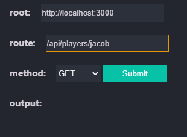

# endpointtester README

A simple endpoint test tool as a vscode extension.

## Features

### Implemented
* Send HTTP requests to local and remote endpoints
* View responses to requests

### Planned
* Create route test flows

## How to use

### Enter root.

### Enter route.

### Enter method.

### View output.

### You can view the response body by clicking the 'body' token.

